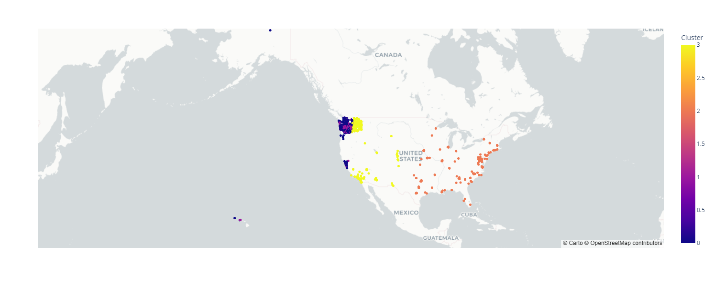
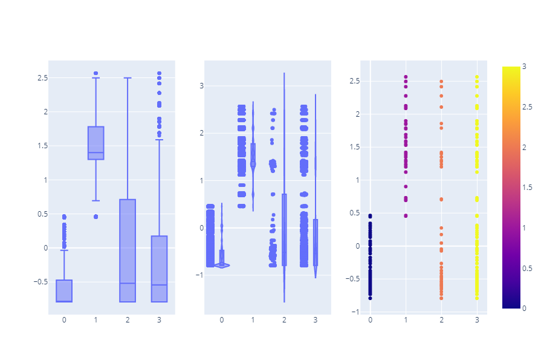

# Electric Vehicle Data Analysis

This is a project that analyzes electric vehicle data to identify vehicles with unusual electric ranges compared to other vehicles with similar features. The data contains information about electric vehicles, such as the make, model, electric vehicle type, electric range, and location. The goal of this project is to identify vehicles with unusual electric ranges and gain insights into the factors that affect the electric range of electric vehicles.

## Data

The data is stored in a CSV file called `Electric_Vehicle_Population_Data.csv` It contains information about electric vehicles, such as the make, model, electric vehicle type, electric range, and location. The data was obtained from public sources and is available for research and educational purposes.

## Analysis

The analysis is performed using Python and the following libraries: Pandas, Plotly Express, Scikit-Learn. The analysis consists of the following steps:

1. Preprocess the data by selecting the relevant features and normalizing the numerical features.
2. Use clustering techniques to group the vehicles based on their features.
3. Compute the mean and standard deviation of the normalized electric range for each cluster.
4. Compute the Z-score for each vehicle's electric range.
5. Identify vehicles with a Z-score above a certain threshold and investigate these vehicles further.

## Results

The analysis identifies several vehicles with unusual electric ranges compared to other vehicles with similar features. Further investigation reveals that these vehicles have certain factors that contribute to their unusual electric range, such as battery degradation, usage patterns, and charging habits.

